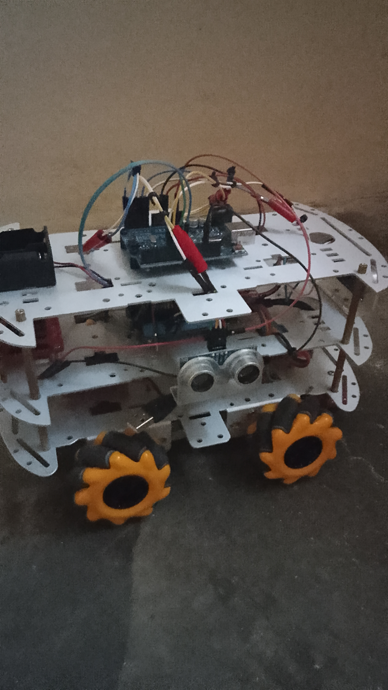
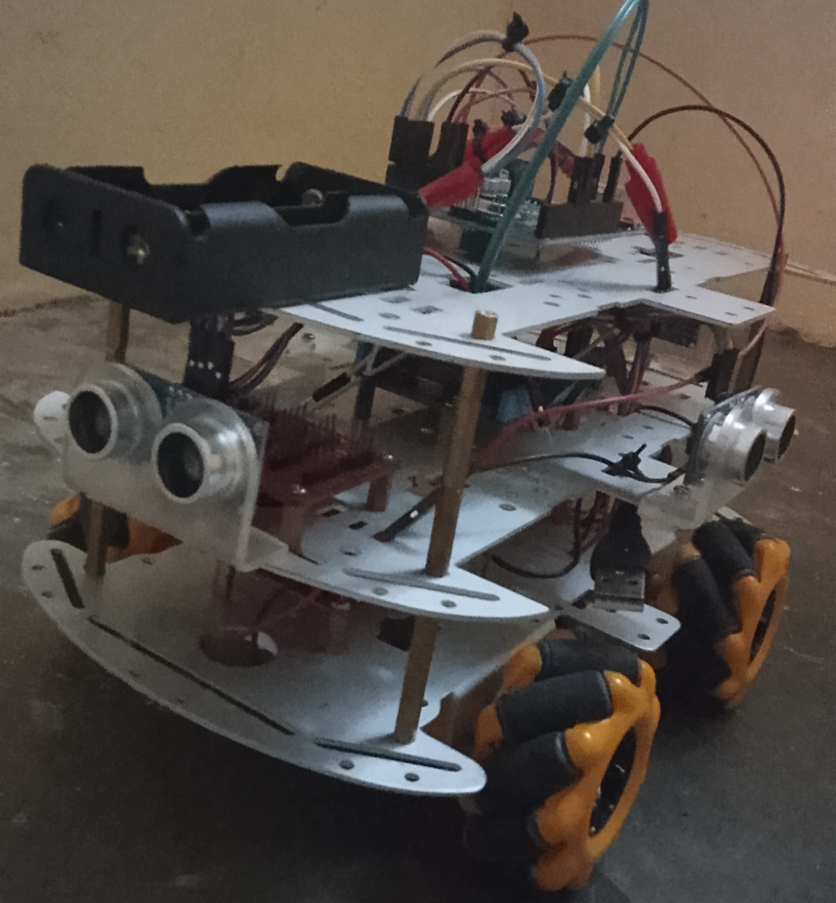
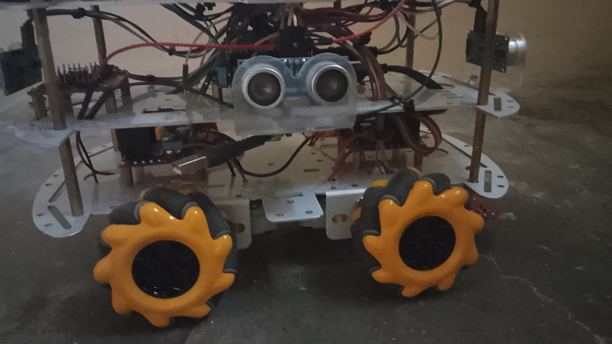
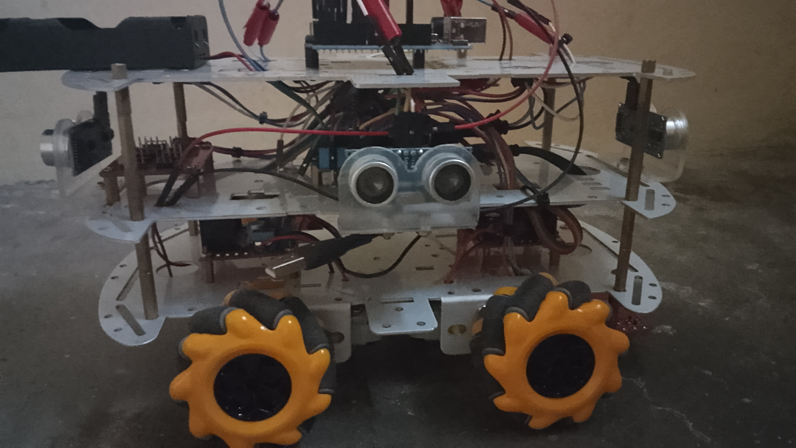

  
   

  

   

  

    
  
  
  
  

   

# NORA: Nomadic Omnidirectional Reactive Automaton

  

## Overview

NORA is an omnidirectional mobile robot platform built around the ESP32, featuring 4-wheel independent drive, ultrasonic obstacle detection in all directions, and UV light capabilities. The robot creates its own WiFi access point for remote control and monitoring.

## Hardware Components

- **ESP32** (ACEBOTT QA007 Max Controller Board)
- **Arduino Uno**
- **2x L298N Motor Drivers**
- **4x 5V DC Motors**
- **4x Ultrasonic Sensors** (HC-SR04 or compatible)
- **UV Light Module**

# Libraries:

<SoftwareSerial.h>
 <WiFi.h>
 <WebServer.h>

ap_ssid     = "NORA";
ap_password = "12345678";

  

Pin Configuration - MOTOR PINS - ESP32

    ENA1: 5

    M1_1: 16

    M1_2: 17

    ENA2: 23

    M2_1: 18

    M2_2: 19

    ENB1: 12

    M3_1: 13

    M3_2: 14

    ENB2: 27

    M4_1: 26

    M4_2: 25

Pin Configuration - Sensors Arduino
Front

    F_TRIG: A0

    F_ECHO: A1

Left

    L_TRIG: 6

    L_ECHO: 7

Back

    B_TRIG: A4

    B_ECHO: A5

Right

    R_TRIG: A2

    R_ECHO: A3

  

ACEBOTT ESP32 Documentation

https://acebottteam.github.io/acebott-docs-master/board/ESP32/QA007%20ESP32%20Max%20V1.0%20Controller%20Board.html

https://acebottteam.github.io/acebott-docs-master/getting%20started/Arduino/Download%20CH340%20Driver%20on%20Windows%20System.html

  

 

© Cursed Entertainment 2026

 

