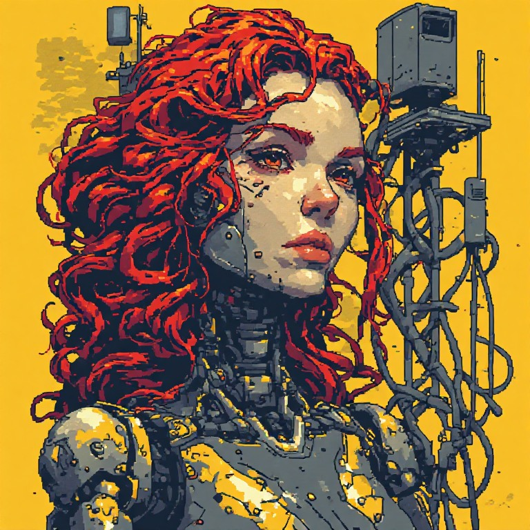
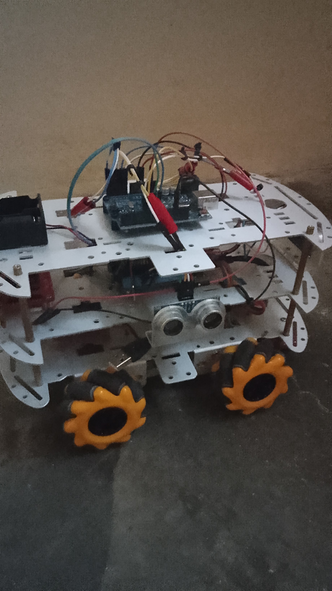
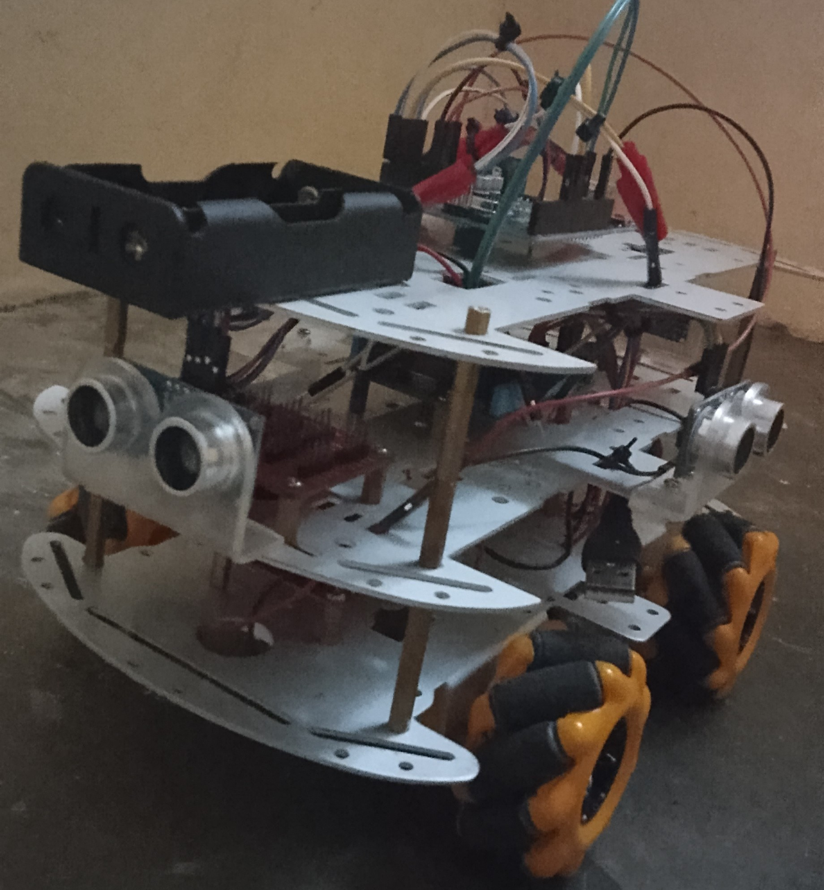
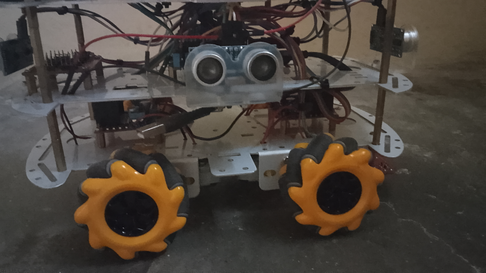
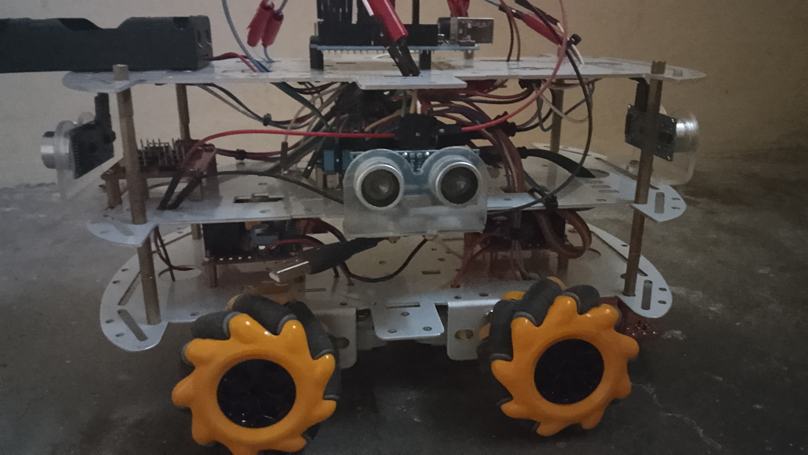
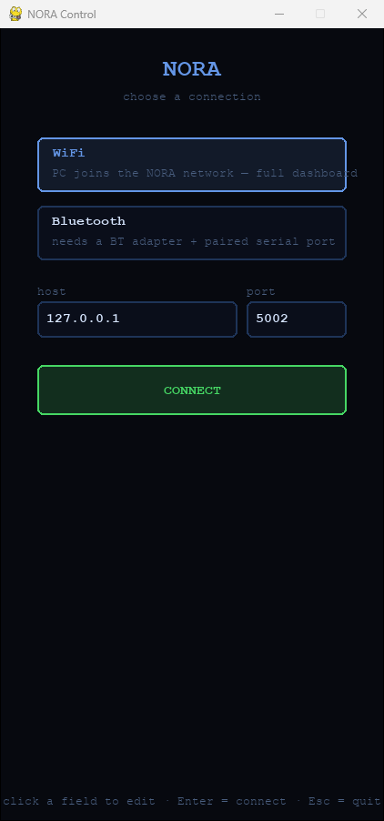
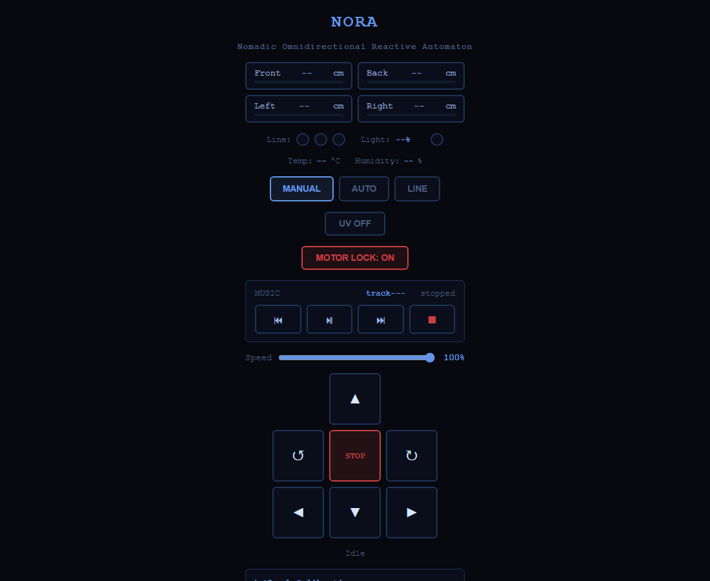

[](https://x.com/NorowaretaGemu)
[](https://opensource.org/licenses/MIT)
  
<div align="center">
  <a href="https://ko-fi.com/cursedentertainment">
    
  </a>
</div>
<div align="center">
  
</div>
<div align="center">
  
  
</div>
<div align="center">
  
</div>


---

# NORA 
## Nomadic Omnidirectional Reactive Automaton

- Robot Type: Mecanum

<div align="center">
  
  <p><i>NORA</i></p>
</div>

---

### Software
- [Arduino IDE](https://docs.arduino.cc/software/ide/)

---

## Related Projects

- [KIDA-Robot-v01](https://github.com/CursedPrograms/KIDA-Robot-v01)
- [KIDA-Robot-v00](https://github.com/CursedPrograms/KIDA-Robot-v00)
- [WHIP-Robot-v00](https://github.com/CursedPrograms/WHIP-Robot-v00)
- [DREAM](https://github.com/CursedPrograms/DREAM)
- [RIFT](https://github.com/CursedPrograms/RIFT)

---

<div align="center">
  
</div>

---

## 📖 Overview

<details>
<summary><b>Overview</b></summary>

NORA is built on the **ESP32**. She hosts the `NORA` WiFi access point the rest of the fleet joins, runs the fleet registry, and drives four mecanum wheels. An Arduino UNO with a SparkFun MP3 Player Shield reads her four ultrasonic sensors, light and sound sensors, plays music and drives the buzzer, and streams it all to the ESP32.

### Core Features
- [x] **Omnidirectional movement:** drive, strafe and turn in place on mecanum wheels.
- [x] **Self-hosted AP:** no router needed; she is the fleet's network and registry (port `5000`).
- [x] **Reactive safety:** four HC-SR04 sensors (front, back, left, right) block drive commands that would hit something, with a buzzer warning.
- [x] **Four drive modes:** Manual (web / Bluetooth), Auto (obstacle avoidance), Line following, IR Remote.
- [x] **Fleet IR remote:** drives IDA, MILA, WHIP and KIDA-01 through her IR transmitter, from the web page, the Python controller or Bluetooth. The panel shows the selected robot's avatar.
- [x] **UV light:** off, on or blinking.
- [x] **Music:** an MP3 player with play, next, previous, stop, repeat and volume. A single clap starts the music.
- [x] **Voice:** she says her mode, motor lock, UV and "Something's in the way" out loud from MP3s on the SD card (falls back to beeps; never talks over music). Make them with `make_voice.bat`.
- [x] **Environment:** temperature and humidity (AHT10), and ambient light.
- [x] **Motor lock:** the web page needs a password (`1234` by default) to unlock the motors.

</details>

---

## Prerequisites
<details>
<summary><b>Prerequisites</b></summary>

### Software
- [Arduino IDE](https://docs.arduino.cc/software/ide/) with the ESP32 board package
- ESP32 libraries: `IRremote` 4.x, `Adafruit AHTX0` (`WiFi`, `WebServer`, `Preferences`, `BluetoothSerial` and `Wire` come with the core)
- UNO libraries: [`SFEMP3Shield` and `SdFat`](https://github.com/madsci1016/Sparkfun-MP3-Player-Shield-Arduino-Library)
- For the ESP32, pick a bigger app partition under **Tools → Partition Scheme**: *Huge APP (3MB No OTA/1MB SPIFFS)* or *Minimal SPIFFS (1.9MB APP with OTA)*

### Hardware

| **Component** | **Details** |
|-----------|---------|
| Microcontroller 0 | ESP32 (ACEBOTT QA007 Max controller board) |
| Microcontroller 1 | Arduino UNO + SparkFun MP3 Player Shield (microSD card) |
| Chassis | Omnidirectional (mecanum) robot chassis |
| Motor drivers | 2× L298N |
| Motors | 4× 5 V DC motors |
| Battery | 2S 18650 |
| Distance | 4× HC-SR04 (front, back, left, right) |
| Ground | 3-channel line tracking sensor |
| Environment | AHT10 temperature / humidity (I2C), photoresistor (LDR) |
| Sound | Sound sensor module (clap detection), buzzer, speaker on the MP3 shield |
| Light | UV LED |
| Remote | NEC IR receiver + remote, IR transmitter LED |
| Controllers | Web page, Python controller (WiFi or Bluetooth), IR remote |

</details>

---

<div align="center">
  
</div>

---

# Schematics
## ⚡ Technical Pinouts

> [!CAUTION]
> **Ground Loop Warning:** All modules must share a common GND. Failure to bridge grounds will cause erratic motor behavior and sensor noise.

<details>
<summary><b>ESP32 wiring</b></summary>

#### L298N-0 (front drive)
| Motor | PWM Pin | Dir 1 | Dir 2 |
| :--- | :--- | :--- | :--- |
| **M0** | `GPIO 5` | `GPIO 16` | `GPIO 17` |
| **M1** | `GPIO 23`| `GPIO 18` | `GPIO 19` |

#### L298N-1 (rear drive)
| Motor | PWM Pin | Dir 1 | Dir 2 |
| :--- | :--- | :--- | :--- |
| **M2** | `GPIO 12` | `GPIO 13` | `GPIO 14` |
| **M3** | `GPIO 27` | `GPIO 26` | `GPIO 25` |

#### Sensors and outputs
| Component | Pin |
| :--- | :--- |
| **Line follower L / M / R** | `GPIO 34` / `GPIO 35` / `GPIO 39` |
| **UV LED** | `GPIO 4` |
| **IR receiver OUT** | `GPIO 32` (power it from **3.3 V**, not 5 V) |
| **IR transmitter LED** | `GPIO 33` (sends the fleet IR link) |
| **AHT10 SDA / SCL** | `GPIO 21` / `GPIO 22` |
| **UNO link** | `RX0` / `TX0` (UART0, 9600 baud) |

</details>

<details>
<summary><b>UNO wiring</b></summary>

#### Ultrasonic sensors
All four TRIG pins are joined to one shared trigger.

| Signal | Pin |
| :--- | :--- |
| **TRIG (all four)** | `A4` |
| **Front ECHO** | `A0` |
| **Right ECHO** | `A1` |
| **Back ECHO** | `A2` |
| **Left ECHO** | `A3` |

#### Other
| Component | Pin |
| :--- | :--- |
| **Photoresistor (LDR)** | `A5` |
| **Sound sensor** | `D5` |
| **Buzzer** | `D10` |
| **ESP32 link** | `D0` (RX) / `D1` (TX), 9600 baud |

The MP3 shield reserves `D2`, `D3`, `D4`, `D6`, `D7`, `D8`, `D9`, `D11`, `D12` and `D13`.

</details>

<details>
<summary><b>ESP32 ↔ UNO serial link</b></summary>

UART at 9600 baud on the UNO's hardware serial (pins 0/1). Like WHIP, unplug the link before uploading to either board.

**UNO → ESP32** (one line per reading):
```
F:23.4,L:10.1,B:45.0,R:8.3,MT:101,MS:1,LT:62,SND:0
```
Distances in cm, `MT` current track, `MS` music state, `LT` light %, `SND` 1 if a sound was just heard.

**ESP32 → UNO:**
```
M:PLAY  M:NEXT  M:PREV  M:STOP  M:REPEAT     music
V:UP  V:DOWN  V:MUTE                          volume
BZ:SPD:<0-100>  BZ:MODE:<0-3>  BZ:UV:<0-2>    buzzer feedback
BZ:LOCK:<0|1>   BZ:DENIED
```

</details>

> [!TIP]
> **Pro-Tip:** Common GND is non-negotiable. If the motors behave erratically or the sensors give "0" readings, check your ground bridge first!

---

## 🌐 Connectivity & Controls

<details>
<summary><b>Connectivity & Controls</b></summary>

### Network Configuration
| Parameter | Value |
| :--- | :--- |
| **SSID** | `NORA` |
| **Password** | `12345678` |
| **Control page** | `http://192.168.4.1:5002` |
| **Fleet registry** | `http://192.168.4.1:5000` (`/register`, `/robots`, `/ping`) |
| **Bluetooth** | Device name `NORA` (serial) |

### RIFT Integration
Connect to the `NORA` network, then reach NORA through [RIFT](https://github.com/CursedPrograms/RIFT) at `http://192.168.4.1:5002`. When a RIFT hub is running it takes over as the fleet authority, and NORA defers to it.

### Drive Modes
| Key | Mode | Description |
| :--- | :--- | :--- |
| `1` | **Manual** | D-pad control from the web page, the Python controller or Bluetooth |
| `2` | **Auto** | Omnidirectional obstacle avoidance using all four ultrasonic sensors |
| `3` | **Line** | Line following with the 3-channel sensor. Stops for anything closer than 15 cm in front |
| `4` | **IR Remote** | The remote's D-pad drives directly. `Enter` swaps left/right between strafing and turning |

Only NORA's own remote (NEC, address `0x00`) is obeyed: IR noise that decodes as some other protocol can't switch her mode any more. Every mode change records who made it (`web`, `bt` or `ir`) as `msrc` in `/sensors` and in the Bluetooth `?` reply.

The mode keys, music, volume and mute work in every mode. The D-pad and Enter only drive in IR Remote mode, so they never fight the web driver or the autonomous logic. There's no key-up over IR, so a 250 ms gap with no repeat counts as "released". The full button map is in [`ir_mapping.txt`](ir_mapping.txt).

### Python controller
```bash
pip install -r requirements.txt
python scripts/controller.py                 # WiFi, NORA at 192.168.4.1:5002
python scripts/controller.py --bt COM7       # Bluetooth serial instead
```

### Fleet IR link
NORA drives [IDA](https://github.com/CursedPrograms/IDA-Robot-v00), MILA, WHIP and KIDA-01 through her IR transmitter (GPIO 33). The frames are Samsung-format IR, one address per robot, with the same commands `0x48`–`0x4F` for all of them. No remote in the fleet uses that protocol, so nothing else reacts, and NORA ignores her own frames on her receiver. Drive commands repeat every 150 ms while held, with `stop` on release; each robot stops by itself if the link goes quiet.

| Robot | Address | Receiver |
| :--- | :--- | :--- |
| [IDA](https://github.com/CursedPrograms/IDA-Robot-v00) | `0x0DA1` | `IDA.ino` |
| [MILA](https://github.com/CursedPrograms/MILA) | `0x0DA2` | `MILA.ino` |
| [WHIP](https://github.com/CursedPrograms/WHIP-Robot-v00) | `0x0DA3` | `esp32.ino` |
| [KIDA-01](https://github.com/CursedPrograms/KIDA-Robot-v01) | `0x0DA4` | `arduino01` sketch (prints the IR lines the Pi already reads) |

Pick the robot with the tabs on the web page's panel, or `<` `>` / `Tab` in the Python controller. The panel's avatar, name and colour follow the selection.

| | Forward / Back / Left / Right | Stop | Obstacle mode | Manual | Speed |
| :--- | :--- | :--- | :--- | :--- | :--- |
| **Web page** (fleet panel) | `I` `K` `J` `L` or the buttons | buttons | button | button | button |
| **Python controller** (right column) | `I` `K` `J` `L` or the buttons | release | `O` | `P` | `Y` |
| **HTTP** | `/link?r=ida\|mila\|whip\|kida&c=fw` `bw` `left` `right` | `stop` | `auto` | `manual` | `speed` |
| **Bluetooth** | `T` + robot (`I` `M` `W` `K`) + `F` `B` `L` `R` | `…S` | `…O` | `…W` | `…X` |

`/ida?c=...` and Bluetooth `I` + letter still drive IDA directly. WHIP has a single gait speed, so `speed` does nothing there.

### Voice
`make_voice.bat` turns her lines into MP3s with Windows text-to-speech (Zira) and ffmpeg: `voice	rack200.mp3`–`track210.mp3`. Copy them to the root of the SD card next to `track000.mp3` (`make_voice.bat E:` copies them for you). The lines are listed at the top of `scripts/make_voice.ps1`:

| Track | Line | When |
| :--- | :--- | :--- |
| 200–203 | Manual / Auto / Line follow / Remote mode | mode changes |
| 204 / 205 | Motors locked / unlocked | motor lock |
| 206 | Something's in the way | a drive command blocked by an obstacle (at most every 3 s) |
| 207–209 | UV off / on / blinking | UV changes |
| 210 | Hello, I'm NORA | after the startup sound |

Missing tracks fall back to the old beeps, and she stays quiet while music is playing. The ESP32 can play any line with `SAY:<n>` on the UNO link.

### Talking with the fleet
Every 30–90 s, when she hasn't driven anyone over the link for 15 s (and isn't being driven by the IR remote), NORA says something to IDA: she beeps a phrase on her buzzer and, once she's finished, sends it over the link, and IDA answers with her reply. The robots talk in **Brainfuck**: every phrase is a Brainfuck program that prints its words (hello is `++++++++[>+++++++++++++<-]>.+.` → `hi`), and a robot says it by beeping the program on its buzzer, one tone per symbol, pitched to its own voice. The phrasebook (`talk_bf.h`) is generated by RIFT's `Fleet/brainfuck_talk.py`: phrases 0–6 (hello, how are you, happy, curious, sleepy, let's play, bye) and their replies 7–13. Between phrases a silent "I am here" beacon goes to IDA, MILA, WHIP and KIDA-01 in turn (each hears it every 8 s); IDA greets NORA when it comes back after a minute away. Her clap detector ignores sounds while she talks, so the beeps don't start the music. [RIFT](https://github.com/CursedPrograms/RIFT) also has her chat with the other robots over WiFi (`GET /chirp?u=<0-13>`) and merges her IR chats into its conversation log.

Phrases (link commands): `0x40` hello, `0x41` how are you, `0x42` happy, `0x43` curious, `0x44` sleepy, `0x45` let's play, `0x46` bye, `0x47` "I am here" beacon (silent).

- `GET /talk` returns the last 12 things she said, as JSON (`{"now":ms,"log":[{"ms":..,"from":"NORA","to":"IDA","said":"hello","text":"hi","bf":"++++++++[>+++++++++++++<-]>.+."}]}`) — the web panel shows the latest four.
- `/talk?r=ida&p=hello` says one now (`p` = `hello` `how` `happy` `curious` `sleepy` `play` `bye`); **SAY HI** on the fleet panel does this for the selected robot.

</details>

---

<div align="center">
  
</div>

---

<details>
<summary><b>📂 Documentation & Assets</b></summary>

* [ACEBOTT ESP32 Max V1.0 Docs](https://acebottteam.github.io/acebott-docs-master/board/ESP32/QA007%20ESP32%20Max%20V1.0%20Controller%20Board.html)
* [CH340 Driver Download](https://acebottteam.github.io/acebott-docs-master/getting%20started/Arduino/Download%20CH340%20Driver%20on%20Windows%20System.html)

</details>

---

<div align="center">
  
</div>

---

## 📡 Who's nearby (ESP-NOW + Bluetooth LE)

Every robot sends a small **"I'm here"** beacon twice a second and listens for the others'. From the **signal strength** it knows roughly how close each one is, and from how that changes over time whether it's **coming closer, steady or leaving**:

| Signal | Zone |
| :--- | :--- |
| above −45 dBm | very close |
| −45 to −60 dBm | near |
| −60 to −75 dBm | medium |
| below −75 dBm | far |

It's coarse (walls, bodies and antenna angle all change it): for "who's around", not distance. Precise collision avoidance stays with the ultrasonic and ToF sensors.

**They tell each other what they're doing**, because a rising signal looks the same from both sides even when only one robot moves. Over ESP-NOW they say it **in Brainfuck**, like the fleet's conversations: each beacon carries a program that prints `park`, `go`, `wait` or `hand` (a human is driving), and the receiver runs it. Bluetooth adverts are too small for a program, so BLE carries the same state as one byte.

**Who makes way**, in self-driving modes only:

| The other robot... | So this one... |
| :--- | :--- |
| is parked | is the one closing in: steers away |
| is yielding | carries on, carefully |
| is driven by a human | makes way (it's unpredictable) |
| drives itself | follows the alphabet: KIDA00, KIDA01, NORA, WHIP; everyone makes way for MILA, who can't hear the others |
| is leaving | carries on |

Making way = stop for 2 s, turn away, then drive on (and not yield again for 5 s, so two robots that stay close don't take turns forever). While another robot is near, or coming closer, it drives slower with wider margins.

NORA hears the others over **ESP-NOW** (WHIP, MILA) and **Bluetooth LE** (WHIP and the Pi robots KIDA-00 / KIDA-01), alongside her WiFi network and classic Bluetooth. In **Auto** mode she drives slower with wider margins while a robot is near, and gives way (stop, wait, turn away) when one with right of way is very close. In **Line** mode she waits on the line instead of turning. `GET /near` shows her list. Code: `scripts/esp32/fleet_near.h` and `fleet_near_ble.h`.

---

## Screenshots

<div align="center">
  
  
</div>

<p align="center"><i>Python controller, Web dashboard. Captured without a robot connected, so live values show their offline state.</i></p>

---

<br>
<div align="center">
© Cursed Entertainment 2026
</div>
<br>
<div align="center">
<a href="https://cursed-entertainment.itch.io/" target="_blank">
    
</a>
</div>
<br>
<div align="center">
  <a href="https://github.com/SynthWomb" target="_blank">
    
  </a>
</div>